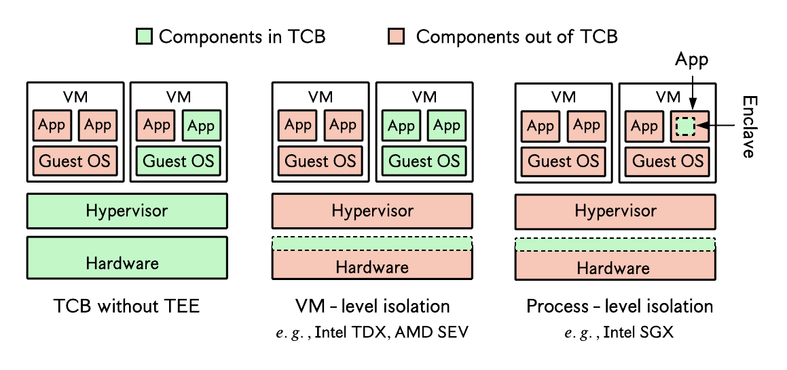

## TEEs for dummies

>This repo helps you get started with setting up and testing _trusted execution environment_ (TEE) technologies like Intel SGX, Intel TDX, AMD SEV-SNP, Arm TrustZone, or GPU TEEs on Nvidia H100.

From my experience, it is often difficult to find practical and concise **hands on** guides on how to use most TEE technologies. Though official documentations are nice, they usually contain too much information not very necessary for a newbie willing to get the general idea and do a few tests. Moreover, it's rare to find articles that bring all of them together.
  
This repo provides a central base with just enough (i.e., minimal) information and easy-to-follow guides on how to setup and do simple tests with well known TEE technologies. It should not be used as a reference guide for deploying your applications in production; in such situations, the official documentations are the most complete and should be followed. This repo, as its name suggests, is a relatively easy starting point for "dummies".

## Background on trusted execution environments
> A Trusted Execution Environment (TEE) is a hardware-enforced secure execution context that enables code to be executed in isolation from the primary operating environment, such as the operating system or hypervisor.

TEEs typically provide some or all of the following security guarantees:
  - **Confidentiality**: ensures the data is not accessible to unauthorized entities.
  - **Integrity**: ensures the data cannot be modified/tampered with by an unauthorized entity; all tampering can be detected.
  - **Freshness**: we always have the most up-to-date version of the secured data.
  

- TEEs use hardware-based mechanisms (i.e., in the CPU) for encrypting memory and enforcing strong access control mechanisms. 

  

<!---->

- TEEs can be broadly classified into two categories: 
    1. TEEs for **process-level isolation**: they enable a process to create a secure encrypted (and integrity-protected) region, usually called an _enclave_, in its address space at runtime. Memory pages in this region can only be decrypted in the CPU. Examples include Intel software guard extensions (SGX) and Arm TrustZone (does only memory access control checks, no encryption).
    2. TEEs for **virtual machine (VM)-level isolation**: they protect entire VMs rather than single programs. Examples: Intel trusted domain extensions (TDX), AMD secure encrypted virtualizatin (SEV) with secure nested paging (SNP), or Arm confidential compute architecture (CCA).

Essentially, the difference between both categories is the degree of isolation they provide, or the size of the _trusted computing base_ (TCB), which represents all software (and hardware) that needs to be trusted.

# Repository structure
There is a folder corresponding to each TEE technology, and each folder contains a Readme file explaining how to setup and test the TEE technology.
1. [Intel SGX](sgx/README.md): deploying SGX applications using the [Intel SGX SDK](sgx/README.md), [Gramine LibOS](sgx/gramine-based/README.md), [Occlum LibOS](sgx/occlum-based/README.md), and a [WebAssembly Runtime](sgx/wasm-based/README.md).
2. [Arm TrustZone](trustzone/README.md): deploying applications protected with Arm TrustZone (Cortex-A), using [OP-TEE](https://docs.nvidia.com/jetson/archives/r36.2/DeveloperGuide/SD/Security/OpTee.html).
3. [Arm CCA](cca/README.md): creating confidential virtual machines or Realms on Arm-based systems.
4. [Intel TDX](tdx/README.md): building TDX-capable confidential VMs.
5. [AMD SEV-SNP](sev-snp/README.md): building SEV-capable confidential VMs.
6. [RISC-V PMP](riscv-pmp/README.md): setting up and testing RISC-V's physical memory protection. 

All the tutorials are Linux-based (mostly Ubuntu). Some links may be added to redirect you to the main website if you use a different OS. Also, if the main TEE website provides a "simple enough" guide, we will just redirect you there. Otherwise, we will do our best to simplify.

The tutorials assume you have TEE-enabled hardware and do not require techniques like remote attestation for hardware verification (used in production). Nevertheless, we provide information on what kind of hardware supports the TEE technology.

## Contributing
Contributions of any kind are welcome! We will publish contributing guidelines and accept pull requests after the project gets more stable.
  

