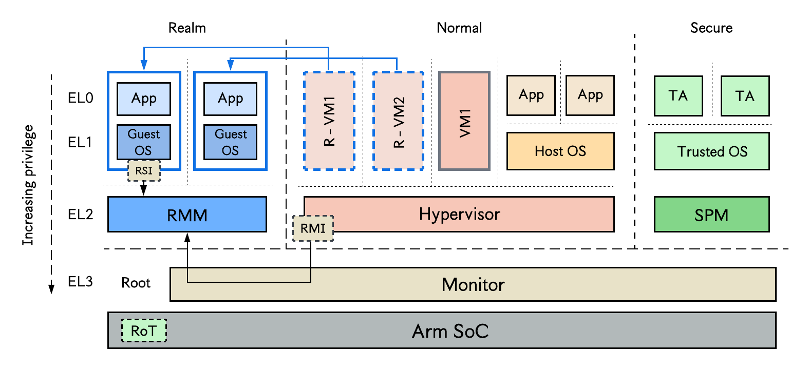

## Arm confidential compute architecture (CCA)
> Arm CCA is an Arm based TEE technology that enables the creation of confidential virtual machines called _Realms_, whose memory is inaccessible to privileged software like the hypervisor or host OS. 
> Arm CCA is based on an extension to the Arm A-profile ISA architecture (v9.2) called _Arm Realm Management Extension_ (RME) which provides the actual hardware primitives for implementing Arm CCA. 

## Arm CCA architecture
As shown in the figure below, CCA introduces _Realm world_, a new physical address space for Realms, separate from existing _non-secure_ (NS)/normal world for running untrusted software stacks, and secure world for deploying trusted applications (See [Arm TrustZone](../trustzone/README.md)). A _realm management monitor_ (RMM) runs in Realm world at a higher privilege level that Realm VMs; it provides the host OS services allowing it to create, populate, execute, and destroy Realms, through a _Realm Management Interface_ (RMI). Each RMI command is implemented as a secure monitor call (SMC), which traps to EL3 monitor, which in turn switches execution to the RMM in Realm world to handle the command. Upon completion of the RMI command, the RMM issues an SMC to ELM3M, which then switches execution back to the hypervisor in Normal world.

  

The RMM also exposes a _Realm Services Interface_ (RSI) through which Realms can request operation for attestation reports, the management of shared memory, etc. A higher-level privilege monitor running in at privilege level EL3 in a new world called Root world. The monitor controls all CPU context switching among the three worlds. 

> The Root world was introduced because Realm and Secure worlds are mutually distrusting. The Root world has access to the entire physical address space. Each CPU core can program the access mode of physical address ranges to be root, realm, secure, or normal world, and a special data structure called the _granule protection table_ (GPT) tracks which physical address belongs to which of the four worlds.
See [this paper](https://www.usenix.org/system/files/osdi22-li.pdf) to understand the access control policy of CCA for each world.

CCA also provides Realm attestation capabilities which enable a remote user to verify that their workload has not be tampered with and is running on a real Arm CCA platform (not simulated). 

## Testing Arm CCA
There is currently no commercialized hardware with Arm CCA support. Most research work Arm CCA simulators. One example is [OpenCCA](https://arxiv.org/html/2506.05129v1), a software framework developed by security researchers at ETH Zurich, enabling early exploration and evaluation of Arm CCA on non-CCA hardware.

## More resources
- [Design and Verification of the Arm Confidential Compute Architecture](https://www.usenix.org/system/files/osdi22-li.pdf)
- [Arm CCA: A New Model of Trusted Execution Environment On The ARM Architecture](https://sys.cs.fau.de/extern/lehre/ws22/akss/material/arm-cca.pdf)
- [ACAI: Protecting Accelerator Execution with Arm Confidential Computing Architecture](https://www.usenix.org/system/files/sec24summer-prepub-56-sridhara.pdf)
- [Confidential Compute Architecture(CCA) on Armv9.2+ Microprocessors](https://gufranmirza.com/blogs/arm-confidential-compute-architecture)