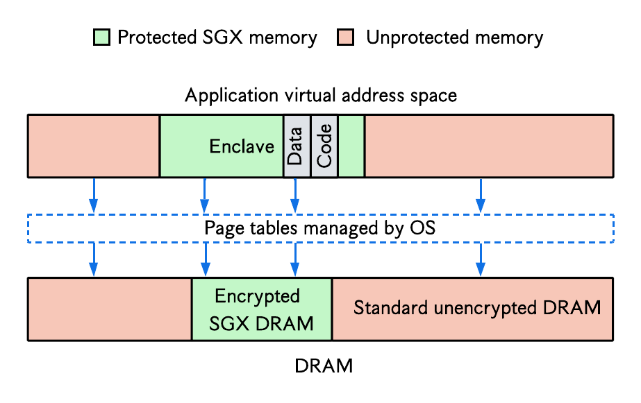
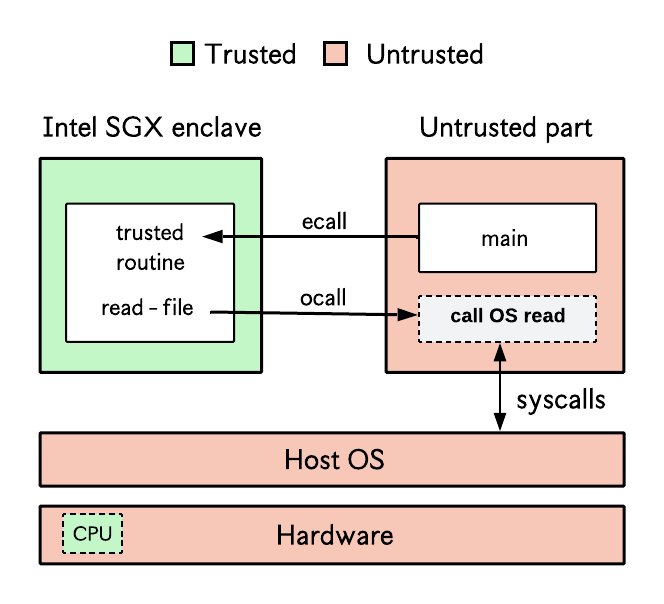

## Intel software guard extensions (SGX)
> Intel SGX is a TEE technology which enables applications to create secure encrypted memory regions called **enclaves**. 
> Enclave memory is inaccessible to privileged software like the OS or hypervisor and can only be decrypted inside the CPU.

At boot time, the processor reserves some portion of DRAM called the _enclave page cache_ (EPC) which is encrypted with a key only known to the CPU. When an application creates an SGX enclave, part of its virtual address space (the enclave) is mapped to this encrypted DRAM region. The pages are transparently decrypted[^1] by an extension of the memory controller called the _memory encryption engine_ (MEE) when they are copied into CPU cache lines. The page tables are still managed by the OS, but the latter cannot access any page in enclave memory. The CPU also performs access control checks to ensure one enclave doesn't access the memory of another enclave. 

<p align="center">
  
</p>

In a production setting, [remote attestation](https://arxiv.org/pdf/2204.06790) is used to authenticate the hardware (i.e., verify it actually supports SGX) and ensure enclave code has not been tampered with.

## System setup

### Hardware verification
[This GitHub page](https://github.com/ayeks/SGX-hardware) provides a list of CPUs and servers with Intel SGX support. On Linux, you can verify presence of SGX capability by building and running the [test-sgx.c]() program providing by the latter repo as follows.
```bash
git clone https://github.com/ayeks/SGX-hardware.git && cd SGX-hardware
gcc -Wl,--no-as-needed -Wall -Wextra -Wpedantic -masm=intel -o test-sgx -lcap cpuid.c rdmsr.c xsave.c vdso.c test-sgx.c
./test-sgx
```
You should see `...Supports SGX` in the result if your server supports SGX. If you don't have SGX support, you can still install SGX software (but no SGX driver) and run applications in SGX simulation mode.[^2]


### SGX software installation

To develop and run applications in an SGX TEE, you need to install three pieces of software:
  1. The Intel SGX SDK
  2. The Intel SGX platform software (PSW)
  3. The Intel SGX driver
   
You can either build these sofware packages from source (See [Intel SGX GitHub](https://github.com/intel/linux-sgx)) or use prebuilt binaries. Since we are dummies, we will go for the prebuilt binaries. 

You can find different releases of these software [here](https://download.01.org/intel-sgx/sgx-linux). For the meantime, we shall focus on the links called "Intel(R) SGX Installers ..." which contain the SDK, PSW, and driver. The "DCAP Installers" are used for handling attestation which we don't need yet. For example, to download the SDK, PSW, and driver for Ubuntu 24.04, you will use [this link](https://download.01.org/intel-sgx/sgx-linux/2.26/distro/ubuntu24.04-server/)

Install software packages required packages by SGX software.
```bash
sudo apt-get install build-essential ocaml automake autoconf libtool wget python3 libssl-dev dkms
sudo update-alternatives --install /usr/bin/python python /usr/bin/python3 1
```
### SGX driver installation
Mainline kernel release 5.11 or higher includes an SGX in-kernel driver: `/dev/{sgx_enclave, sgx_provision}`. You can verify the presence of this with `ls -la /dev/sgx*`. If your kernel does not include the in-kernel driver, download and install the driver for your Ubuntu release. For example, for Ubuntu 24.04:
```bash
wget https://download.01.org/intel-sgx/sgx-linux/2.26/distro/ubuntu24.04-server/sgx_linux_x64_driver_1.41.bin #
chmod 777 sgx_linux_x64_driver_${version}.bin # make the installer executable
sudo ./sgx_linux_x64_driver_${version}.bin # run the installer
```

### SGX PSW installation
The PSW is a runtime software stack to support the execution of SGX applications. For example, it handles SGX enclave creation, SGX context switches, attestation services, etc.
- Setup apt source list to point to prebuilt PSW packages on Intel's servers.
```bash
# For Ubuntu 24.04; see SGX installation guide for other OS versionss
echo 'deb [trusted=yes arch=amd64] https://download.01.org/intel-sgx/sgx_repo/ubuntu noble main' | sudo tee /etc/apt/sources.list.d/intel-sgx.list
```
- Install packages
```bash 
sudo apt-get update
sudo apt-get install libsgx-epid libsgx-quote-ex libsgx-dcap-ql
```
### SGX SDK installation
The SDK provides a framework for building SGX-based applications. Download and install the prebuilt package as follows.
```bash
wget https://download.01.org/intel-sgx/sgx-linux/2.26/distro/ubuntu24.04-server/sgx_linux_x64_sdk_2.26.100.0.bin # download SDK installer
chmod +x sgx_linux_x64_sdk_2.26.100.0.bin # make installer executable
sudo ./sgx_linux_x64_sdk_2.26.100.0.bin # run SDK installer
# Specify /opt/intel as install directory
```
For further instructions on how to install and setup these software components, see the [Intel SGX SW Installation Guide for Linux](https://download.01.org/intel-sgx/latest/dcap-latest/linux/docs/Intel_SGX_SW_Installation_Guide_for_Linux.pdf).

- To verify that your system is ready to run SGX applications, you can download use the [sgx-detect]() tool by Fortanix. (TODO: complete)

## Testing simple SGX applications
The SGX SDK provides sample applications in it's installation directory. If you installed the SDK in `/opt/intel`, the sample code folder should be located in `/opt/intel/sgxsdk/SampleCode`. Copy this folder to your working directory, e.g., somewhere in your home folder.
```bash
sudo cp -rf /opt/intel/sgxsdk/SampleCode .
sudo chown -R $USER:$USER SampleCode # fixes permission issues 
```
Build and run a simple SGX program like `SampleEnclave` to test your SGX installation.
```bash
cd SampleCode/SampleEnclave
make 
./app # or sudo ./app
```
The result: "Sample Enclave successfully returned" indicates your SGX program ran successfully.

## Developing SGX applications with the SDK
The SGX SDK requires that developers partition their applications into a `trusted part` which executes in the enclave (i.e., TEE) and an `untrusted part` which executes out of the TEE, like a regular application. Each sample application provided by the SDK is structured this way: the `App` folder contains all code for the untrusted side, while the `Enclave` folder contains all code for the trusted side. The SGX SDK provides mechanisms to context switch between both parts at run time: `ocalls` allows a thread in enclave mode to context switch out of enclave mode, e.g., to perform a system call like `read` or `write`, and `ecalls` allow a thread in non-enclave mode to context switch into enclave mode. This is illustrated in the figure below.

<p align="center">
  
</p>


### Is SGX really securing my data?
The `sgx-sdk-program` provides a very simple SGX application to test this. We create a secure buffer inside the enclave [my_secure_buffer](), and one outside the enclave []. We then try to access these buffers through the OS.

- First build the application with `make` and run it with `./app`. 
- TODO:

## Library operating systems
Manually partitioning code into trusted and untrusted parts following the SGX SDK design can be complex for some applications. To mitigate this problems, library OSes like [Gramine](./gramine-based/README.md) or [Occlum](./occlum-based/README.md) have been developed; they enable unmodified applications to run in SGX enclaves. See the associated subfolders for guides on how to test them.

## WebAssembly in SGX
See [this readme](./wasm-based/README.md).

## Other resources
- For further information on building Intel SGX applications, consult the [Intel SGX Developer Reference for Linux]().
- [Quarkslab's blog: Overview of Intel SGX - Part 1, SGX Internals](https://blog.quarkslab.com/overview-of-intel-sgx-part-1-sgx-internals.html)
- [Quarkslab's blog: Overview of Intel SGX - Part 2, SGX Internals](https://blog.quarkslab.com/overview-of-intel-sgx-part-2-sgx-externals.html)
- [Intel SGX explained by Victor Costan and Srinivas Devadas](https://eprint.iacr.org/2016/086.pdf)
- [A list of SGX-related publications](https://github.com/vschiavoni/sgx-papers/)
- [Awesome SGX](https://github.com/Jim8y/awesome-sgx)


[^1]: The initial SGX implementation also performed memory integrity checks using a Merkle tree; this (indirectly) put a constraint on total EPC memory which was usually in the order of 256MB. Recent versions of SGX (SGX Scalable) have removed this Merkle tree-based integrity verification, sacrificing some security guarantees to support larger EPC sizes (e.g., 64GB) and improved performance.
[^2]: To run an SGX SDK application in simulation mode, change the Makefile variable `SGX_MODE` from `SGX_MODE ?= HW` to `SGX_MODE ?= SIM` (or anything different from HW).


