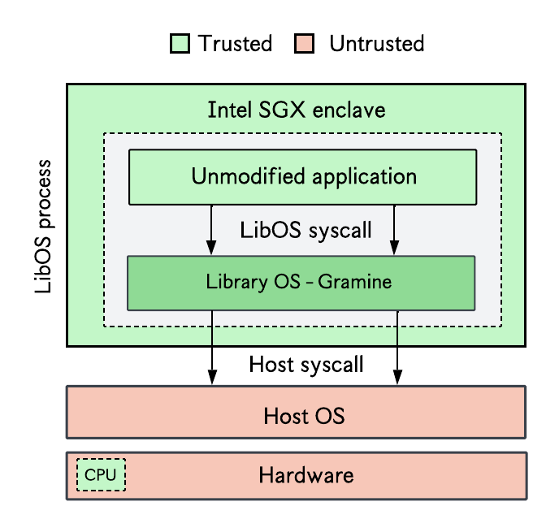

## Gramine
Gramine (formerly Graphene-SGX) is a library OS which allows to run unmodified applications inside an SGX enclave, as illustrated in the figure below. It is useful in scenarios where an application is either too complex to be partitioned as done with the SDK.

<p align="center">
  
</p>

Gramine began as an academic project and is based on this paper: [Graphene-SGX: A Practical Library OS for Unmodified Applications on SGX](https://www.usenix.org/system/files/conference/atc17/atc17-tsai.pdf). Using a library OS like Gramine increases the TCB of your SGX application, but makes deployment simpler.[^1]


## Installing Gramine
To install Gramine on Ubuntu 22.04 or 24.04 do:
```bash
sudo curl -fsSLo /etc/apt/keyrings/gramine-keyring-$(lsb_release -sc).gpg https://packages.gramineproject.io/gramine-keyring-$(lsb_release -sc).gpg
echo "deb [arch=amd64 signed-by=/etc/apt/keyrings/gramine-keyring-$(lsb_release -sc).gpg] https://packages.gramineproject.io/ $(lsb_release -sc) main" \
| sudo tee /etc/apt/sources.list.d/gramine.list

sudo curl -fsSLo /etc/apt/keyrings/intel-sgx-deb.asc https://download.01.org/intel-sgx/sgx_repo/ubuntu/intel-sgx-deb.key
echo "deb [arch=amd64 signed-by=/etc/apt/keyrings/intel-sgx-deb.asc] https://download.01.org/intel-sgx/sgx_repo/ubuntu $(lsb_release -sc) main" \
| sudo tee /etc/apt/sources.list.d/intel-sgx.list

sudo apt-get update
sudo apt-get install gramine
```
For other OSes, see the [official Gramine installation documentation](https://gramine.readthedocs.io/en/latest/installation.html)

Generate an enclave signing key; the generated key is stored in `$HOME/.config/gramine/enclave-key.pem`
```bash
gramine-sgx-gen-private-key
```

## Deploying an SGX-protected program with Gramine
Gramine programs need to be configured using a manifest file. Clone the helloworld example from the Gramine repo to have an idea of how this is done.
```bash
git clone --depth 1 --branch v1.2 https://github.com/gramineproject/gramine.git && cd gramine/CI-Examples/helloworld
```
You can build the Gramine application with SGX support (if you have the hardware support) or without SGX (if you do not have SGX-capable hardware) as follows.
```bash
# build and run with SGX
make SGX=1
gramine-sgx helloworld

# build and run without SGX 
make
gramine-sgx helloworld
```

- TODO: explain how the manifest file works


## Other resources
- [Gramine official documentation](https://gramine.readthedocs.io/en/latest/)

[^1]: one core challenge in systems security is the constant trade-off (or "tug of war") between three factors: security, usability, and performance. Improving one often comes at the expense of the other two.