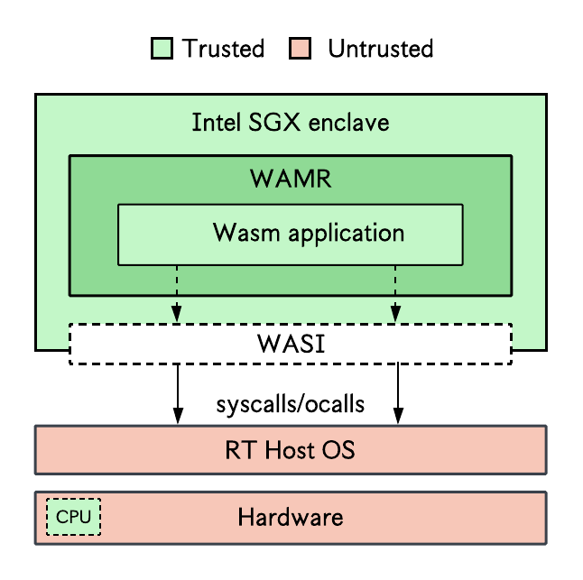

## WebAssembly (Wasm)
> WebAssembly (Wasm) is a portable compilation target initially designed for web environments but has since been extended to support standalone execution. Traditional applications can be written in a high-level programming language, e.g., C/C++, Rust, Go, and compiled into a Wasm binaries for execution in constrained environments across multiple hardware platforms, such as x86, ARM, and RISC-V. Academic projects like [Twine](https://arxiv.org/pdf/2103.15860) integrate a Wasm runtime, e.g., WAMR, into an SGX enclave, as shown in the figure below. This enables unmodified applications to execute in the enclave, similar to a LibOS. 

  

