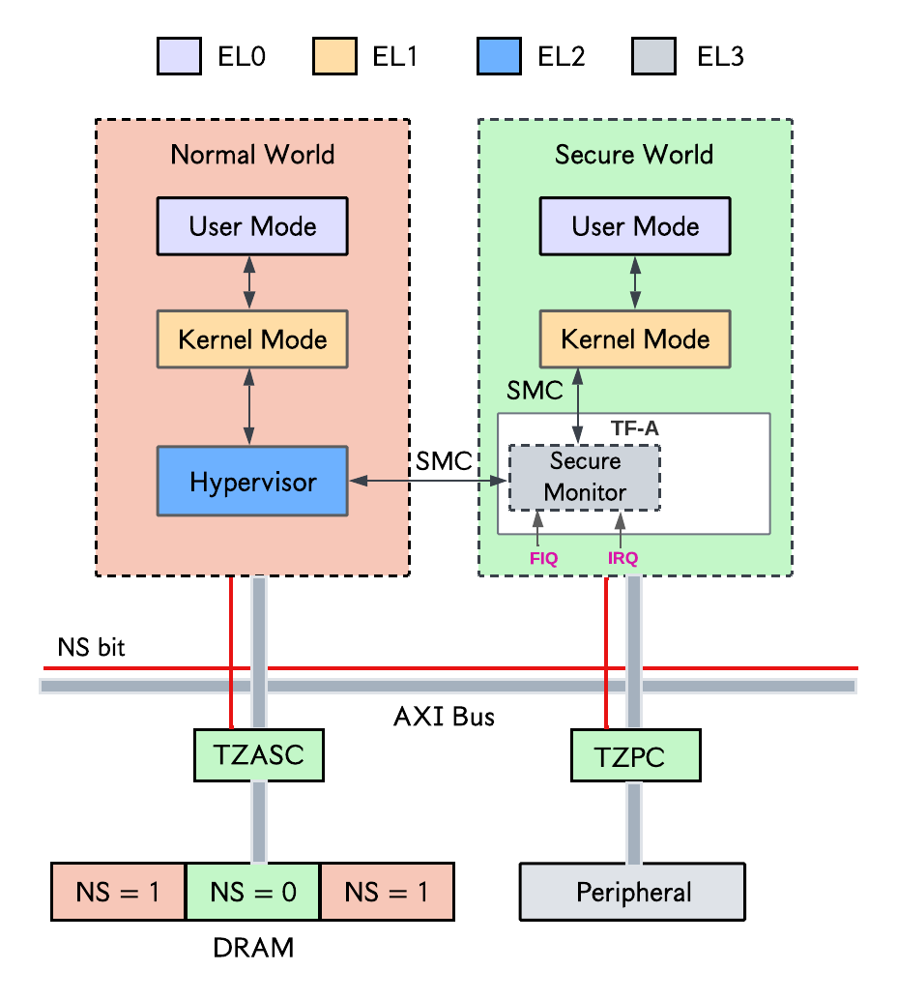

## Arm TrustZone

Arm TrustZone (TZ) is a hardware security extension in ARM-based processors that allows the processor to be split into two protection domains: a **secure world**, wherein data is processed securely and isolated from the host OS (or hypervisor), and a **normal world** which has no access to secure world resources. At any point in time, the processor operates exclusively in one of these worlds. A privileged software component called a _secure monitor_ enables context switching between both worlds using _secure monitor calls_ (SMC), analogous to SGX ecalls and ocalls.

A hardware component called the **TrustZone address space controller**(TZASC) enforces the separation between the secure world and the normal world by controlling access to physical memory. Essentially, TZASC can be programmed/configured such that some parts of physical memory (contiguous blocks) are only accessible in the secure world, or both worlds. A special bit called the _non-secure_ (NS) bit, stored in the _secure configuration register_(SCR), is used to determine which world the processor is currently operating in.

<!---->

  

Contrary to TEE technologies like SGX which encrypt data stored in memory, TZ only performs access control checks to ensure confidentiality. 

## Hardware and software setup
From my experience with Arm TrustZone, it is often trickier to get the right hardware with decent software support when compared to server-end TEEs like SGX. I believe this is partly due to the fragmented nature of the Arm ecosystem, as Arm licences IP to many different SoC vendors (STMicro, NXP, HiSilicon, Broadcom, etc). Nevertheless, for beginners, I recommend boards by [STMicroelectronics](). They are relatively cheap and provide excellent documentation. STM provides both Cortex-M (M for "microcontroller") processors for low power microcontroller applications, and Cortex-A (A for "Application") processors for running full-fledged OSes like Linux. 

For this tutorial/guide, the board we will use is the [STM32MP157D-DK1](https://www.st.com/resource/en/data_brief/stm32mp157d-dk1.pdf) which features a Cortex-A7 core, TrustZone support, and excellent documentation.

### OP-TEE (Open Trusted Execution Environment)
Even with a board that supports TrustZone, one still needs the right software tools to build programs that can leverage TrustZone's security features in a useful way. This is where [OP-TEE](https://docs.nvidia.com/jetson/archives/r36.2/DeveloperGuide/SD/Security/OpTee.html) comes in. It is an open source framework for building applications secured with TrustZone technology.[^1] 
A simple analogy is that OP-TEE is to TrustZone what the Intel SGX SDK is to SGX. Similar to SGX, a TrustZone-based application running in OP-TEE constitutes two parts: a _client application_ (CA) which represents the untrusted part of the program executing in normal world, and a _trusted application_ (TA) which is the trusted part executing in the secure world.

> The official OP-TEE documentation defines it as : "a Trusted Execution Environment (TEE) designed as companion to a non-secure Linux kernel running on Arm Cortex-A cores using the TrustZone technology". 
> Personally, I think this definition could be confusing to a beginner who considers TrustZone as the "TEE" technology. Hence I refer to OP-TEE as a framework for building TZ applications. 

As shown in the figure below, OP-TEE comprises two main components: `optee-os` which is the trusted side of OP-TEE (executes in the secure world), and `optee_client`, which is the untrusted side of OP-TEE (executes the normal world). The secure monitor bridges both components.
1. `optee-os`: is a TEE OS executing at ARMv8 secure EL-1 level which provides generic OS-level functions like interrupt handling, thread handling, crypto services, and shared memory. It implements the [GlobalPlatform TEE Internal Core API](https://globalplatform.org/wp-content/uploads/2021/03/GPD_TEE_Internal_Core_API_Specification_v1.3.1_PublicRelease_CC.pdf), which is used to implement TAs that run in the secure world at ARMv8 secure EL-0 level.
2. `optee-client`: consists of two parts: a normal-world user-space library and a normal-world user-space daemon. The library, `libteec.so`, implements the [GlobalPlatform TEE Client API](https://globalplatform.org/wp-content/uploads/2010/07/TEE_Client_API_Specification-V1.0.pdf), providing the interface through which normal-world CAs interact with TAs in the secure world. The daemon, TEE-supplicant, provides auxiliary functionality for the trusted OS, such as enabling file system access to load TAs from the normal-world file system into the secure world.

  

### Chain of trust
In Arm TrustZone and OP-TEE, a [_chain of trust_](https://developer.arm.com/documentation/102418/0102/Software-architecture/Boot-and-the-chain-of-trust) ensures that each stage of boot is authenticated. It starts from the BootROM, which represents _root of trust_ (RoT) or anchor for the chain of trust. This RoT then authenticates the first-stage bootloader, which in turn authenticates the second-stage bootloader, and so on.  Processes like secuer boot define and implement this chain of trust. See [more details here](https://docs.nvidia.com/drive/drive_os_5.1.6.1L/nvvib_docs/index.html#page/DRIVE_OS_Linux_SDK_Development_Guide/Windows%20Systems/security_concepts.html#wwpID0E04S0HA).

## Building OP-TEE for the STM32MP157D-DK1
See [this readme](./stm32-dk1-optee.md)

## More TrustZone documentation and publications
1. [Demystifying Arm TrustZone: A Comprehensive Survey](https://www.dpss.inesc-id.pt/~nsantos/papers/pinto_acsur19.pdf)
2. [TrustZone Explained: Architectural Features and Use Cases](https://www.researchgate.net/profile/Bernard-Ngabonziza-2/publication/312182612_TrustZone_Explained_Architectural_Features_and_Use_Cases/links/59f26a8a0f7e9beabfcc636b/TrustZone-Explained-Architectural-Features-and-Use-Cases.pdf)
3. [Nice article on Arm TrustZone and OP-TEE](https://www.linkedin.com/pulse/arm-trustzone-unlocking-secure-world-embedded-systems-khaled-el-sayed-a3hpf/)
4. [OP-TEE on Nvidia Jetson](https://docs.nvidia.com/jetson/archives/r36.2/DeveloperGuide/SD/Security/OpTee.html)

## Other platforms with good TrustZone and OP-TEE support
1. [Nvidia Jetson boards](https://docs.nvidia.com/jetson/archives/r36.2/DeveloperGuide/SD/Security/OpTee.html)
2. [All platforms mentioned here](https://optee.readthedocs.io/en/latest/general/platforms.html)

[^1]: Though OP-TEE was initially created for Arm TrustZone, it has been structured to be compatible with other isolation technologies.

